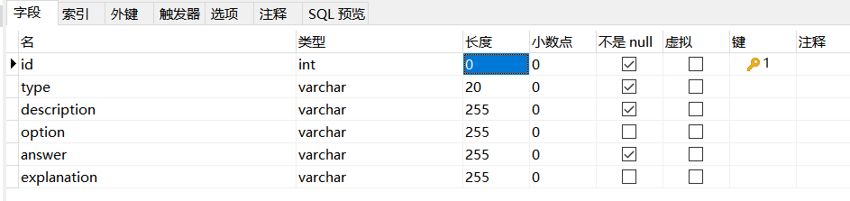

# boya-backend
博雅学院老师的项目的后端

## 题库实现

### 数据库设计

使用mysql，数据库名为`boya`，题目表名为`question_bank`，存放题目相关信息：information_schema

|    字段     |       数据类型        |                       描述                       |
| :---------: | :-------------------: | :----------------------------------------------: |
|     id      | int unsigned NOT NULL |                   自增逻辑主键                   |
|    type     | varchar(10) NOT NULL  |        题目类型（单选、多选、填空、简答）        |
|    theme     | varchar(10) NOT NULL  |        题目主题        |
| description | varchar(255) NOT NULL |                       题干                       |
|   option    |     varchar(255)      | 题目选项（题目为选择题的情况下有效），以换行分隔 |
|   answer    | varchar(255) NOT NULL |         题目答案，若有多个答案以换行分隔         |
| explanation |     varchar(255)      |                     答案解析                     |



可以直接使用Navicat等可视化工具新建查询，然后运行如下sql命令增加题目（注意字符串最好不要换行，会引入`\n`、`\t`啥的）：

```mysql
INSERT INTO question_bank (`type`, `description`, `option`, `answer`, `explanation`)
		VALUES ("单选_诗句填空",
				"关关雎鸠，在河之洲。窈窕淑女，君子好逑。参差荇菜，_______。窈窕淑女，________。",
				"A 左右采之；琴瑟友之 \n B 左右流之；寤寐求之 \n C 左右采之；寤寐求之 \n D 左右流之；求之不得",
			    "C",
				"略"
			);
```

### 功能实现

题目的查询，暂不支持修改、增加等操作（除非到时候要做一个教师端）。