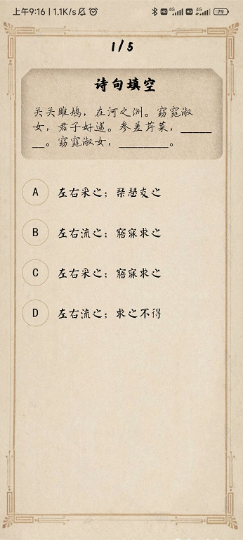

<h1 align='center'> boya-backend </h1>

<h5 align='center'> Design by LXH, ZX, HTH | Direct by Prof Wu</h5>

博雅学院老师的项目的后端，采用mysql+FastAPI，数据库名为`boya`。
# 1 首页


## 1.1 发送用户数据

==可能后面要添加用户成绩等属性==

### 1.1.1 数据库设计

表名为`user`，存放用户相关信息：
|   字段   |        数据类型         |       描述       |
| :------: | :---------------------: | :--------------: |
|   `id`   | `int unsigned NOT NULL` |   自增逻辑主键   |
| `openid` | `varchar(50) NOT NULL`  | 微信用户的唯一id |
| `uname`  | `varchar(40) NOT NULL`  |     微信昵称     |

可以直接使用Navicat等可视化工具新建查询，然后运行如下sql命令增加题目（注意字符串最好不要换行，会引入`\n`、`\t`啥的）。

### 1.1.2 ==后端API实现==

- 登录，`POST`
  
    - `input`：
    
        ```json
        {
            uname:"xxx", // 微信昵称
            avator_url:"xxx", // 微信头像链接
            openid:"xxx"  //微信的openid
        }
        ```
    - `output`:
       ```json
       {"code": 200, "message": "success"}
       ```

<div STYLE="page-break-after: always;"></div>

# 2 诗情画意（诗经百科）

## 2.1 诗歌的展示


### 2.1.1 数据库设计

表名为`poem`，存放诗歌相关信息：

|     字段      |        数据类型         |               描述               |
| :-----------: | :---------------------: | :------------------------------: |
|     `id`      | `int unsigned NOT NULL` |           自增逻辑主键           |
|   `poem_id`   | `int unsigned NOT NULL` |              诗歌id              |
|    `title`    | `varchar(20) NOT NULL`  |             诗歌名称             |
|   `content`   |     `varchar(400)`      |             诗歌内容             |
| `explanation` |     `varchar(1000)`     |               解说               |
| `annotation`  |     `varchar(600)`      |               注释               |
| `picture_id`  |     `int unsigned`      | 对应的图片id，为空时说明没有图片 |

### 2.1.2 ==后端API实现==

- 返回所有诗歌的题目和id，`GET`
  
    - `input`：
    
      ```json
      无
      ```
      
    - `output`:
    
      ```json
      {	
      "feng":[ 
    		{
    			poem_id: 1,
    			title: "xxxx"
    		},
    		...
    	]
    	"ye":[
    		{
    			poem_id: 2,
    			title: "yyyy"
    		},
    		...
    	]
    	"song":[
    		{
    			poem_id: 3,
    			title: "zzzz"
    		},
    		...
    	]}
      ```

- 给定诗歌id，返回对应信息，`GET`

  - `input`：
    
    ```json
    poem_id:1
    ```
    
  - `output`:
    
    ```json
    {
    	poem_id: 1,
    	title: "sss",
    	content: "sss",
    	explanation: "sdasdad",
    	annotation: "sadsad",
    	picture_id: 11,
        audio_url: "www.xxx.com"
    }
    ```

## 2.2 配图的展示


### 2.2.1 数据库设计

表名为`picture`，存放图片相关信息（和上面分开是因为不是所有诗歌都会有图片）：

|     字段     |        数据类型         |       描述       |
| :----------: | :---------------------: | :--------------: |
|     `id`     | `int unsigned NOT NULL` |   自增逻辑主键   |
| `picture_id` |     `int unsigned`      |     图片的id     |
|   `title`    | `varchar(40) NOT NULL`  | 诗歌名称，即出处 |
|  `abstract`  |     `varchar(100)`      |     原文摘要     |
| `annotation` |     `varchar(600)`      |       图解       |

### 2.2.2 ==后端API实现==

- 给定图片id，返回简略信息，`GET`
  
    - `input`：
    
      ```json
      picture_id
      ```
      
    - `output`:
    
      ```json
      {
          title: "xxx",
    	    abstract: "xxx" ,
    		picture_url: "xxx",
    		pinying_url: "xxx"
    	}
    	```
    
- 给定图片id，返回详细信息（了解更多），`GET`

  - `input`：
    
    ```json
    picture_id
    ```
    
  - `output`:
    
    ```json
    {
        title: "xxx"
        abstract: "xxx" 
        annotation: "xxx" 
    	picture_url: "xxx"
    	pinying_url: "xxx"
    }
    ```

<div STYLE="page-break-after: always;"></div>

# 3 渐入佳境（单机，无飞花令）


## 3.1 文海磨砺（诗经题库）



### 3.1.1 数据库设计

表名为`question_bank`，存放题目相关信息：

|    字段     |       数据类型        |                       描述                       |
| :---------: | :-------------------: | :----------------------------------------------: |
|     `id`     | `int unsigned NOT NULL` |                   自增逻辑主键                   |
|    `type`    | `varchar(10) NOT NULL` |        题目类型（单选、多选、填空、简答）        |
|    `theme`    | `varchar(10) NOT NULL` |        题目主题        |
| `description` | `varchar(255) NOT NULL` |                       题干                       |
|   `option`   |     `varchar(255)`     | 题目选项（题目为选择题的情况下有效），以换行分隔 |
|   `answer`   | `varchar(255) NOT NULL` |         题目答案，若有多个答案以换行分隔         |
| `explanation` |     `varchar(255)`     |                     答案解析                     |

可以直接使用Navicat等可视化工具新建查询，然后运行如下sql命令增加题目（注意字符串最好不要换行，会引入`\n`、`\t`啥的）：

```mysql
INSERT INTO question_bank (`type`, `theme`, `description`, `option`, `answer`, `explanation`)
		VALUES ("单选",
				"诗句填空",
				"关关雎鸠，在河之洲。窈窕淑女，君子好逑。参差荇菜，_______。窈窕淑女，________。",
				"A 左右采之；琴瑟友之 \n B 左右流之；寤寐求之 \n C 左右采之；寤寐求之 \n D 左右流之；求之不得",
			    "C",
				"略"
			);
```

### 3.1.2 后端API实现

题目的查询，暂不支持修改、增加等操作（除非到时候要做一个教师端）。

之前已经实现了：

- `get-all`：返回所有题目的信息（包括诗歌内容等关于问题的所有信息）
- `get/{id}`：根据题目id来返回对应的题目。

考虑加一个：

- `get-all-id`：返回所有题目的id，因为`get-all`可能返回的内容太多了。

## 3.2 补字成诗（生僻字）


### 3.2.1 数据库设计

表名为`question_padding`，存放题目相关信息：

|     字段      |        数据类型         |        描述        |
| :-----------: | :---------------------: | :----------------: |
|     `id`      | `int unsigned NOT NULL` |    自增逻辑主键    |
| `description` | `varchar(255) NOT NULL` | 题干，挖掉了一个字 |
|   `answer`    |   `char(2) NOT NULL`    | 题目答案，一个汉字 |

### 3.2.2 ==后端API设计==

- 返回所有题目id，`GET`

  - `input`：

      ```json
      无
      ```

  - `output`:

    ```json
    [1, 2, 3, 4, 5, 6, ...]
    ```
  
- 给定题目id，返回题目信息，`GET`

  - `input`：

    ```json
    id
    ```

  - `output`:

    ```json
    {
        id: 11,
        description: "xxx",
    	answer: "xxx"
    }
    ```

- 给定图片base4，返回识别结果，`POST`
  - `input`：

    ```json
    {
        image:base4
    }
    ```

  - `output`:
  
    ```json
    {
    	answer: "xxx"
    }
    ```


<div STYLE="page-break-after: always;"></div>

# 4 与诗会友（双人对战，目前就只有飞花令）

## 4.1 对战匹配


### 4.1.1 数据库设计

现在可以直接开个字典，之后可能要换nosql

### 4.1.2 ==后端API实现==

- 创建密令，`POST` or `GET`？

  - `input`：

    ```json
    无
    ```

  - `output`:

    ```json
    token: "xxxxx"
    ```

- 使用密令进入房间（双方都要用），`POST`

  - `input`：

    ```json
    openid: "xxxxx" 用户id
    token: "xxxxx"
    ```
  
  - `output`:
  
    ```json
    {
        unames: ["xxxx", "xxxx"],
     	avator_url: ["www.xxx", "www.xxx"],
        session_id: 123,
        question: "x"
    }
    ```

==这里是搞个等待界面还是说先让一个进房间等==

## 4.2 飞花令


### 4.2.1 数据库设计

现在可以直接开个字典，之后可能要换nosql

### 4.2.2 ==后端API实现==

- 验证答案是否正确，`POST`

  - `input`：

    ```json
    {
        openid: "xxxxx",
        session_id: 123, // 后端使用这个查找对应房间的题目并验证
        answer: str
    }
    ```

  - `output`：

    ```json
    {
        isright: True
    }
    ```

    