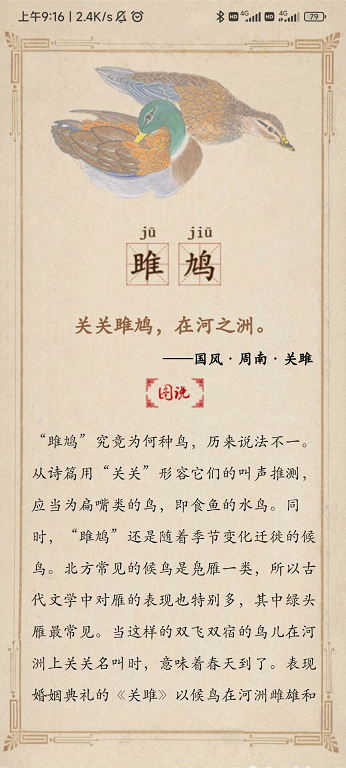

<h1 align='center'> boya-backend </h1>

<h5 align='center'> Design by LXH, ZX, HTH | Direct by Prof Wu</h5>

博雅学院老师的项目的后端，采用mysql+FastAPI，数据库名为`boya`。
# 1 首页


## 1.1 发送用户数据

==可能后面要添加用户成绩等属性==

### 1.1.1 数据库设计

表名为`user`，存放用户相关信息：
|     字段     |        数据类型         |       描述       |
| :----------: | :---------------------: | :--------------: |
|     `id`     | `int unsigned NOT NULL` |   自增逻辑主键   |
|   `openid`   | `varchar(50) NOT NULL`  | 微信用户的唯一id |
|   `uname`    | `varchar(40) NOT NULL`  |     微信昵称     |
| `avator_url` |     `varchar(255)`      |     微信头像     |

可以直接使用Navicat等可视化工具新建查询，然后运行如下sql命令增加题目（注意字符串最好不要换行，会引入`\n`、`\t`啥的）。

### 1.1.2 后端API实现

- 登录，`POST`
  
    若用户不存在则新建，否则更新用户信息
    
    - `input`：
    
        ```json
        {
            uname:"xxx", // 微信昵称
            avator_url:"xxx", // 微信头像链接
            openid:"xxx"  //微信的openid
        }
        ```
    - `output`:
       ```json
       {"code": 200, "message": "success"}
       ```

<div STYLE="page-break-after: always;"></div>

# 2 诗情画意（诗经百科）

## 2.1 诗歌的展示


### 2.1.1 数据库设计

表名为`poem`，存放诗歌相关信息：

|     字段      |        数据类型         |               描述               |
| :-----------: | :---------------------: | :------------------------------: |
|     `id`      | `int unsigned NOT NULL` |           自增逻辑主键           |
|   `poem_id`   | `int unsigned NOT NULL` |              诗歌id              |
|    `title`    | `varchar(20) NOT NULL`  |             诗歌名称             |
|   `content`   |     `varchar(1000)`     |             诗歌内容             |
| `explanation` |     `varchar(2000)`     |             诗歌解说             |
| `annotation`  |     `varchar(2000)`     |             诗歌注释             |
| `picture_id`  |     `int unsigned`      | 对应的图片id，为空时说明没有图片 |

可以直接使用Navicat等可视化工具新建查询，然后运行如下sql命令增加题目（注意字符串最好不要换行，会引入`\n`、`\t`啥的）：

```mysql
INSERT INTO poem (`poem_id`, `title`, `content`, `explanation`, `annotation`, `picture_id`)
		VALUES (1,
				"国风·周南·关雎",	"关关雎鸠，在河之洲①。\n窈窕淑女，君子好逑②。\n参差荇菜，左右流之③。\n窈窕淑女，寤寐求之④。\n求之不得，寤寐思服⑤。\n悠哉悠哉，辗转反侧⑥。\n参差荇菜，左右采之。\n窈窕淑女，琴瑟友之⑦。\n参差荇菜，左右芼之⑧。\n窈窕淑女，钟鼓乐之⑨。",
				"《关雎》，西周贵族婚姻典礼上的乐歌，由诗篇中“琴瑟”“钟鼓”同时出现可知。诗篇以初春时节冰消雪化的河洲上“关关”和鸣的水鸟起兴，强调婚礼的合乎时节。继而强调夫妻情深，以此来祝愿未来的家庭和睦，生活幸福。全篇格调温润娴雅，特别是开头的起兴，更为诗篇平添了兴味。",
			    "①关关：鸟雌雄和鸣声。犹言“呱呱”，状声词。从叫声可知为扁嘴,旧说鱼鹰，不确。雎鸠：又名王雎，喜食鱼，随季候迁移，当这样的鸟儿出现在北方河洲时，意味着春天到来，该是万物生长的季节了。\n②窈窕：庄重高雅。联绵词。女子内有气质，外有仪容，称窈窕。淑女：贤德女子。君子：指贵族男子，《诗经》中“君子”一词多见，有时指周王，有时指贵族，有时为女子称丈夫。逑：配偶。\n③参差：长短不齐。荇（xìng）菜：水藻类植物，今名杏菜，又名水荷、金莲儿等（图2）。流：求取，捞取。\n④寤寐：寤，醒着；寐，睡着；寤寐，不分睡着醒着的意思。\n⑤思服：思，语助词。服：想念，放在心上。一说思、服同义。\n⑥ 悠哉：悠，思念深长。悠哉可指夜漫长，也可指思绪悠长。\n⑦ 辗转：翻来覆去。双声叠韵词。 反侧：与辗转同义。\n⑧ 琴瑟：两种木质弦乐器（琴见《小雅·鹿鸣》图 161、瑟见《小雅·鼓钟》图 195）。周代高级贵族典礼，堂上乐工四人，两人歌诗，两人操琴瑟伴唱，称升歌；堂下有钟鼓演奏乐曲，称金奏。此诗“琴瑟”与“钟鼓”同时出现，正暗示出典礼场合。友：亲近，加深情感。金文字形为手挽手，本义指亲兄弟，后推而广之为志同道合者。以兄弟关系喻夫妻关系和谐，《诗经》中屡见。\n⑨芼（mào）：择取。《安徽大学藏战国竹简》（一）（以下简称“安大简”）此字作“教”，或为“芼”的通假、误写。\n⑩钟鼓：两种敲击乐器（钟见《小雅·彤弓》图172、鼓见《周颂·执竞》图232）。敲击钟鼓奏乐，为周代古代高级贵族典礼现象。钟，考古发现，商代开始用青铜铸造铙，形制与后来的钟近似，后来发展为编钟。西周较早时期就有了三件一套的编钟。鼓，起源更早，在大汶口文化时期已出现，后来的陶寺遗址也出土过木鼓，鼓腔内还有鳄鱼残留物，可知当时的鼓用鳄鱼皮蒙制。 乐之：使之愉悦。",
				1
			);
```

另外还有两个音频的url，分别对应诗歌的朗诵音频和赏析音频，暂且存在本机服务器上，后端根据poem_id构造。

### 2.1.2 后端API实现

- 返回所有诗歌的题目和id，`GET`
  
    - `input`：
    
      ```json
      无
      ```
      
    - `output`:
    
      ```json
      {	
      "feng":[ 
    		{
    			poem_id: 1,
    			title: "xxxx"
    		},
    		...
    	]
    	"ya":[
    		{
    			poem_id: 2,
    			title: "yyyy"
    		},
    		...
    	]
    	"song":[
    		{
    			poem_id: 3,
    			title: "zzzz"
    		},
    		...
    	]}
      ```

- 给定诗歌id，返回对应信息，`GET`

  - `input`：
    
    ```json
    poem_id:1
    ```
    
  - `output`:
    
    ```json
    {
    	poem_id: 1,
    	title: "sss",
    	content: "sss",
    	explanation: "sdasdad",
    	annotation: "sadsad",
    	picture_id: 11,
        recite_url: "www.xxx.com",
        appreciation_url:"www.xxx.com"
    }
    ```

## 2.2 配图的展示




### 2.2.1 数据库设计

表名为`picture`，存放图片相关信息（和上面分开是因为不是所有诗歌都会有图片）：

|     字段     |        数据类型         |       描述       |
| :----------: | :---------------------: | :--------------: |
|     `id`     | `int unsigned NOT NULL` |   自增逻辑主键   |
| `picture_id` |     `int unsigned`      |     图片的id     |
|   `title`    | `varchar(40) NOT NULL`  | 诗歌名称，即出处 |
|  `abstract`  |     `varchar(100)`      |     原文摘要     |
| `annotation` |     `varchar(1000)`     |       图解       |

可以直接使用Navicat等可视化工具新建查询，然后运行如下sql命令增加题目（注意字符串最好不要换行，会引入`\n`、`\t`啥的）：

```mysql
INSERT INTO picture (`picture_id`, `title`, `abstract`, `annotation`)
		VALUES (1,
				"国风·周南·关雎",	
                "关关雎鸠，在河之洲",
				'雎鸠究竟为何种鸟，历来说法不一。从诗篇用"关关"形容它们的叫声推测，应当为扁嘴类的鸟，即食鱼的水鸟。同时，"雎鸠"还是随着季节变化迁徙的候鸟。北方常见的候鸟是凫雁一类，所以古代文学中对雁的表现也特别多，其中绿头雁最常见。当这样的双飞双宿的鸟儿在河洲上关关鸣叫时，意味着春天到了。表现婚姻典礼的《关雎》以候鸟在河洲雌雄和鸣开篇，正与诗篇内容相映成趣，比兴也是有意味的。'
			);
```

### 2.2.2 后端API实现

- 给定图片id，返回简略信息，`GET`
  
    - `input`：
    
      ```json
      picture_id
      ```
      
    - `output`:
    
      ```json
      {
          title: "xxx",
    	    abstract: "xxx" ,
    		picture_url: "xxx",
    		pinyin_url: "xxx"
    	}
    	```
    
- 给定图片id，返回详细信息（了解更多），`GET`

  - `input`：
    
    ```json
    picture_id
    ```
    
  - `output`:
    
    ```json
    {
        title: "xxx"
        abstract: "xxx" 
        annotation: "xxx" 
    	picture_url: "xxx"
    	pinying_url: "xxx"
    }
    ```

<div STYLE="page-break-after: always;"></div>

# 3 渐入佳境（单机，无飞花令）


## 3.1 文海磨砺（诗经题库）


### 3.1.1 数据库设计

表名为`question_bank`，存放题目相关信息：==这个只能存100个字左右，对于长文本可能不够==

|    字段     |       数据类型        |                       描述                       |
| :---------: | :-------------------: | :----------------------------------------------: |
|     `id`     | `int unsigned NOT NULL` |                   自增逻辑主键                   |
|    `type`    | `varchar(10) NOT NULL` |        题目类型（单选、多选、填空、简答）        |
|    `theme`    | `varchar(10) NOT NULL` |        题目主题        |
| `description` | `varchar(255) NOT NULL` |                       题干                       |
|   `option`   |     `varchar(255)`     | 题目选项（题目为选择题的情况下有效），以换行分隔 |
|   `answer`   | `varchar(255) NOT NULL` |         题目答案，若有多个答案以换行分隔         |
| `explanation` |     `varchar(255)`     |                     答案解析                     |

可以直接使用Navicat等可视化工具新建查询，然后运行如下sql命令增加题目（注意字符串最好不要换行，会引入`\n`、`\t`啥的）：

```mysql
INSERT INTO question_bank (`type`, `theme`, `description`, `option`, `answer`, `explanation`)
		VALUES ("单选",
				"诗句填空",
				"关关雎鸠，在河之洲。窈窕淑女，君子好逑。参差荇菜，_______。窈窕淑女，________。",
				"A 左右采之；琴瑟友之 \n B 左右流之；寤寐求之 \n C 左右采之；寤寐求之 \n D 左右流之；求之不得",
			    "C",
				"略"
			);
```

### 3.1.2 后端API实现

题目的查询，暂不支持修改、增加等操作（除非到时候要做一个教师端）。

之前已经实现了：

- `get-all`：返回所有题目的信息（包括诗歌内容等关于问题的所有信息）
- `get/{id}`：根据题目id来返回对应的题目。

又加了一个：

- `get-all-id`：返回所有题目的id，因为`get-all`可能返回的内容太多了。

## 3.2 补字成诗（生僻字）


### 3.2.1 数据库设计

表名为`question_padding`，存放题目相关信息：

|     字段      |        数据类型         |        描述        |
| :-----------: | :---------------------: | :----------------: |
|     `id`      | `int unsigned NOT NULL` |    自增逻辑主键    |
| `description` | `varchar(255) NOT NULL` | 题干，挖掉了一个字 |
|   `answer`    |   `char(2) NOT NULL`    | 题目答案，一个汉字 |

### 3.2.2 ==后端API设计==

- 返回所有题目id，`GET`

  - `input`：

      ```json
      无
      ```

  - `output`:

    ```json
    [1, 2, 3, 4, 5, 6, ...]
    ```
  
- 给定题目id，返回题目信息，`GET`

  - `input`：

    ```json
    id
    ```

  - `output`:

    ```json
    {
        id: 11,
        description: "xxx",
    	answer: "xxx"
    }
    ```

- 给定图片utf-8编码的base64编码，==返回识别结果==，`POST`
  - `input`：

    ```json
    {
        image:base4
    }
    ```

  - `output`:
  
    ```json
    {
    	answer: "xxx"
    }
    ```


<div STYLE="page-break-after: always;"></div>

# 4 与诗会友（双人对战，目前就只有飞花令）

## 4.1 对战匹配


### 4.1.1 数据库设计

现在可以直接开个字典，之后可能要换nosql

### 4.1.2 后端API实现

- 创建六位密令， `GET`

  - `input`：

    ```json
    无
    ```

  - `output`:

    ```json
    token: "xxxxxx"
    ```

- 使用密令进入房间（双方都要用），`ws`

  - `input`：

    ```json
    openid: "xxxxx" 用户id
    token: "xxxxx"
    ```
  
  - `output`:
  
    长连接，当后端检测到两个用户均进入到房间时广播用户信息
    
    ```json
    {
        unames: ["xxxx", "xxxx"],
     	avator_url: ["www.xxx", "www.xxx"]
    }
    ```

==这里是搞个等待界面还是说先让一个进房间等==

## 4.2 飞花令


### 4.2.1 数据库设计

现在可以直接开个字典，之后可能要换nosql

### 4.2.2 ==后端API实现==

- 在``对战匹配`的长连接里`验证答案是否正确`，

  - 前端在长连接里发送信息：

    ```json
    {
        openid: "xxxxx",
        token: 123, // 后端使用这个查找对应房间的题目并验证
        answer: str，//这个应该是音频？
    }
    ```

  - 后端在长连接里判断后返回：

    ```json
    {
        isright: True，
        text:"xxx",//音频转的文字
    }
    ```
    
    